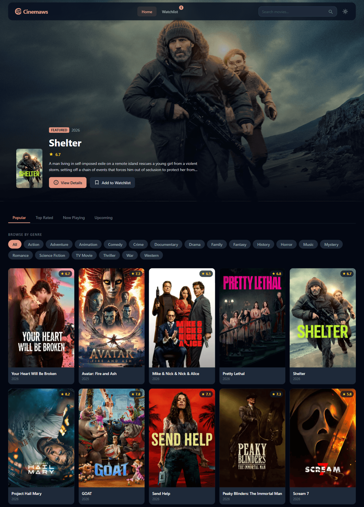
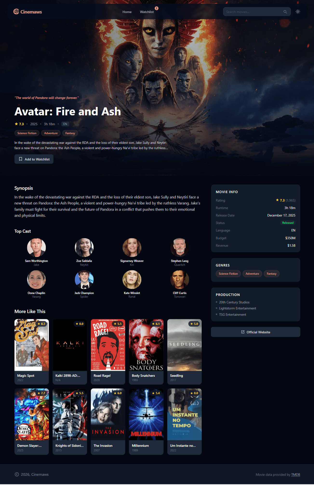

# 🎬 Cinemaws - Movie Browser App

A simple yet slick movie browser app built with Vue 3 + TypeScript and powered by TMDB API.
Browse movies, search favorites, and save to watchlist so you never forget what to watch next 🍿

---

## ✨ Features

- 🏠 **Home Page** – Browse **popular movies** from TMDB
- 🔍 **Search Page** – Find movies by **keyword**
- 🎥 **Movie Detail Page** – Complete movie info (rating, overview, genre, cast, similar movies)
- ❤️ **Watchlist Page** – Save and manage your favorite movies
- 🎭 **Genre Filter** – Filter movies by genre
- 🌙 **Dark Mode** – Eye-friendly for late-night browsing
- 💾 **Local Storage Persist** – Watchlist persists across sessions

---

## 🧩 Tech Stack

- ⚡️ [Vue 3](https://vuejs.org/) + [TypeScript](https://www.typescriptlang.org/)
- 🎨 [TailwindCSS](https://tailwindcss.com/) – Fast & responsive styling
- 💾 [Pinia](https://pinia.vuejs.org/) + `pinia-plugin-persistedstate` – state management & persist watchlist
- 🧠 [VueUse](https://vueuse.org/) – Utility composables
- 🧭 [Vue Router](https://router.vuejs.org/) – Page navigation
- 🌐 [Axios](https://axios-http.com/) – TMDB API calls
- 🔣 [oh-vue-icons](https://oh-vue-icons.netlify.app/) – Beautiful icons

---

## 📁 Project Structure

```bash
src/
├── assets/
│   └── main.css
├── components/
│   ├── common/
│   │   ├── AppHeader.vue
│   │   ├── AppFooter.vue
│   │   ├── BaseButton.vue
│   │   ├── LoadingState.vue
│   │   ├── ErrorState.vue
│   │   └── EmptyState.vue
│   ├── movie/
│   │   ├── MovieCard.vue
│   │   ├── MovieGrid.vue
│   │   ├── MovieHero.vue
│   │   ├── MovieMeta.vue
│   │   ├── GenreFilter.vue
│   │   ├── WatchlistButton.vue
│   │   ├── MovieSuggestions.vue
│   │   ├── CastSuggestions.vue
│   │   └── SimilarMoviesSection.vue
├── composables/
│   ├── addIcons.ts
│   ├── useMovies.ts
│   ├── useMovieDetail.ts
│   ├── useSearchMovies.ts
│   ├── useSearchCast.ts
│   ├── useGenres.ts
│   └── useImageUrl.ts
├── pages/
│   ├── HomePage.vue
│   ├── SearchPage.vue
│   ├── MovieDetailPage.vue
│   ├── WatchlistPage.vue
│   └── NotFoundPage.vue
├── router/
│   └── index.ts
├── services/
│   ├── axios.ts
│   └── movieService.ts
├── stores/
│   ├── watchlist.ts
│   ├── search.ts
│   └── theme.ts
├── types/
│   └── movie.ts
├── utils/
│   ├── formatDate.ts
│   └── formatRating.ts
├── App.vue
└── main.ts
```

---

## 🚀 Quick Start

Clone and install:

```bash
git clone https://github.com/syawaljasira/cinemaws.git
cd cinemaws
npm install
```

⚠️ Set TMDB API Key (Required!)
Create .env file in project root with your TMDB API key:

```bash
VITE_TMDB_API_KEY=your_tmdb_api_key
```

Get your API key:

1. Sign up at TMDB

2. Go to Settings > API

3. Create new API key (v3 auth)

Run Development Server

```bash
npm run dev
```

Build for Production

```bash
npm run build
npm run preview
```

---

## 🖼️ Preview





---

## ❤️ Built With Love

Made for fun and learning modern Vue 3.
If you like this project, feel free to give it a ⭐ on GitHub! 😄[p]

---

## 📜 License

MIT License © 2026 syawaljasira
